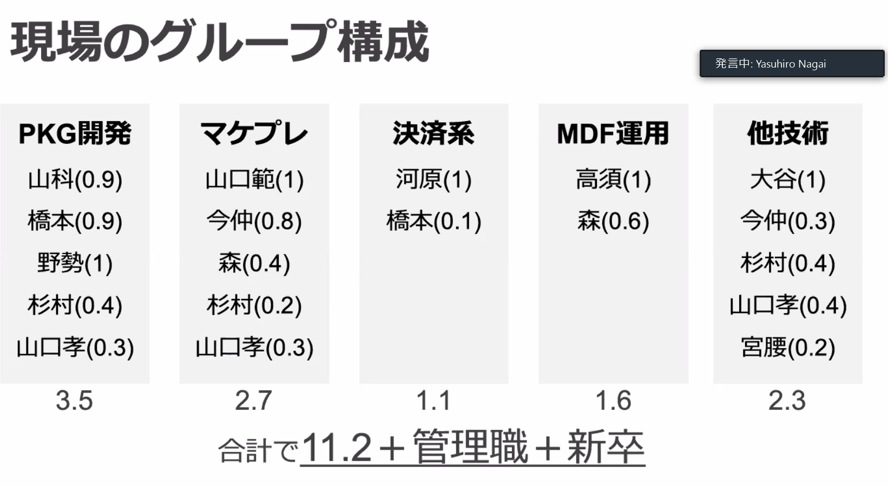
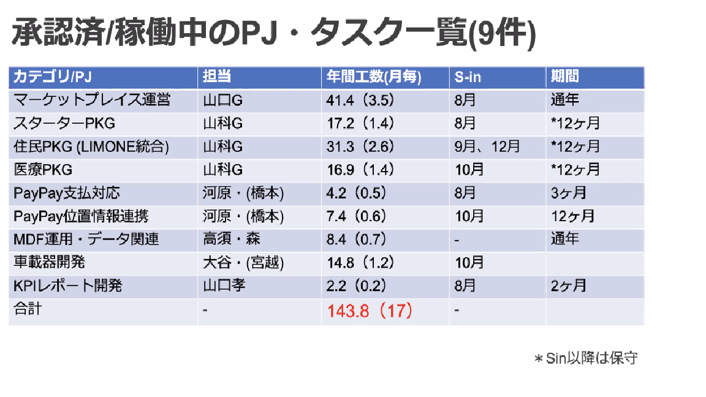
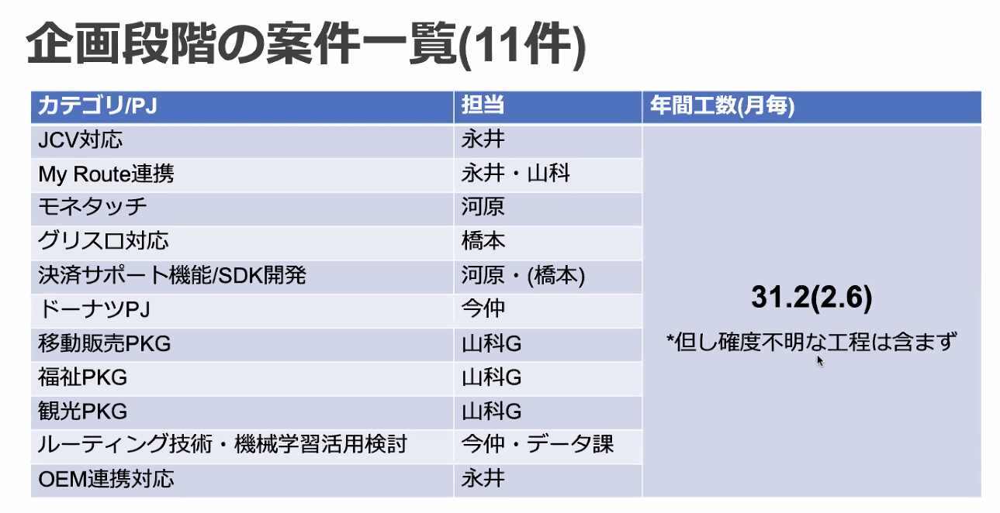
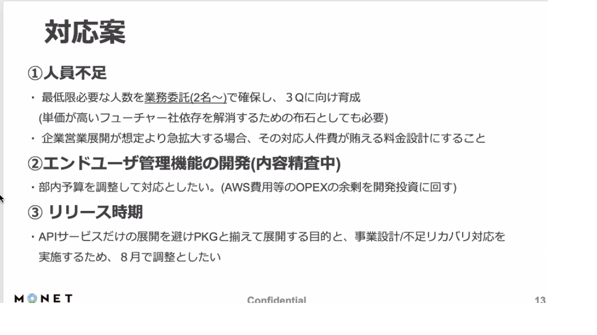
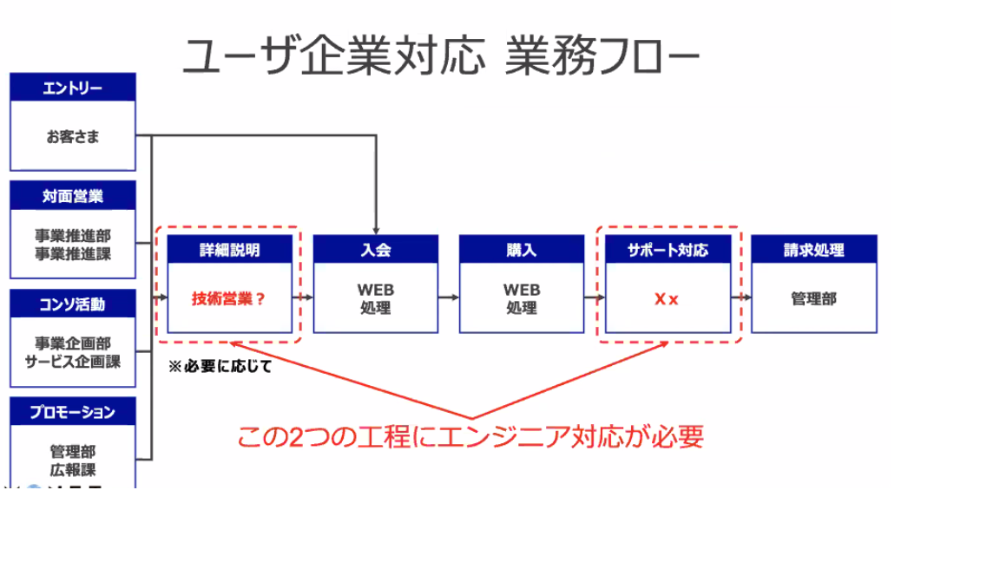

# 議事録リンク先

-[20200521 人流データ](https://docs.google.com/document/d/1JqlV3OttSLx4XduCMhwuGddlEmNaeHSVm_57yrSprFk/edit)

-[20200608 MONET PF報告]()

### 課題
- 全体のリソース不足
- プロダクト/サービス運用
### 湧川さんコメント
- 切れるところは切る. コアのシステム開発が最優先
- リソースを増やすのは難しい.社内(IT)から引っ張てこれるなら引っ張って. 先端は余裕ない  

### 湧川さんコメント
- 新規枠は増える. 人増やして対応できるならやって.
- ドキュメント作成は新卒に投げてもいいんじゃない
